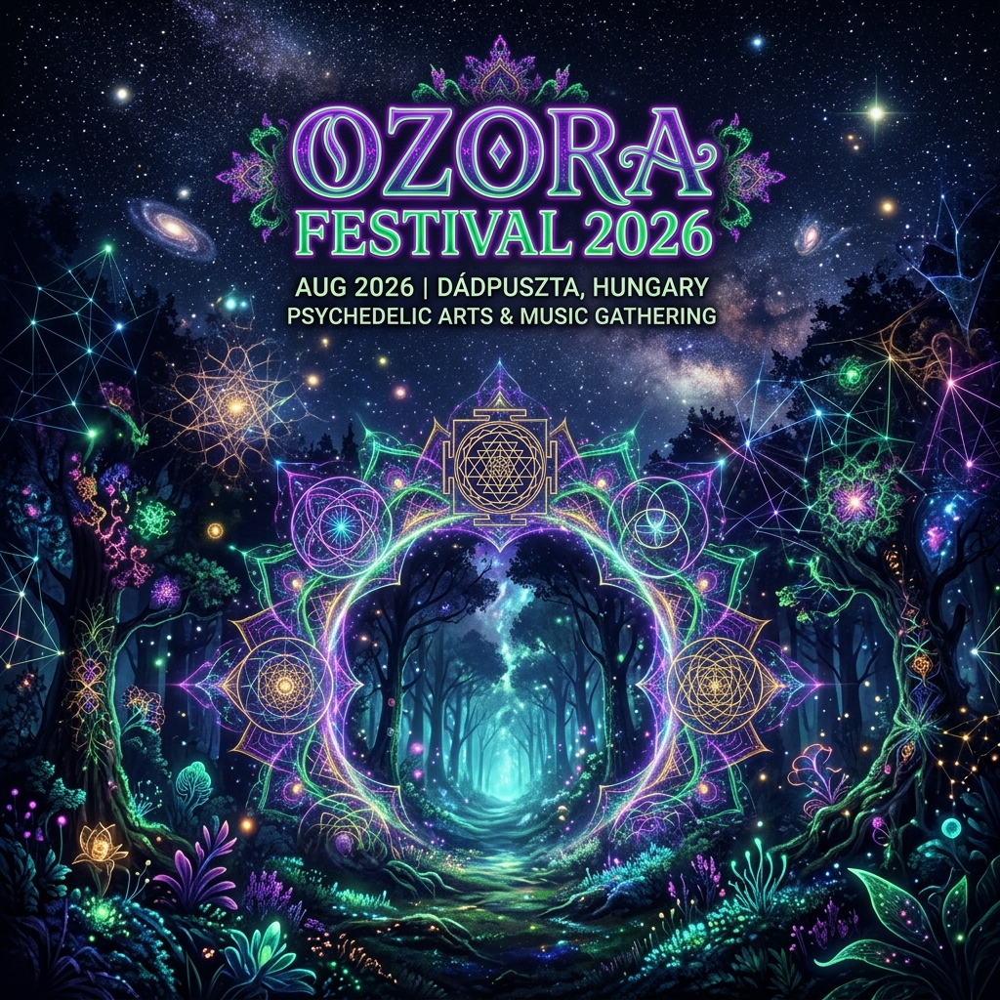

# Ozora Festival 2026 - Timetable Companion

[עברית 🇮🇱](README.he.md) | **English 🇬🇧**


Welcome to the **Ozora 2026 Timetable Companion**—an immersive, feature-rich web application designed to help festival-goers navigate the legendary psytrance festival in Hungary (July 25 – Aug 3, 2026). 

This application is built not just as a schedule utility, but as a sensory experience that brings the psychedelic, cosmic, and natural spirit of Ozora directly into the browser. It is optimized to perform flawlessly under real festival conditions: readable in direct sunlight, atmospheric in the dark, and easy to use on mobile devices in low-connectivity environments.

---

## 🌟 Key Features

### 1. 🌀 Interactive Psychedelic Visuals & Themes
*   **Alive, Not Animated:** The UI features organic, breathing backdrop designs via custom SVG filters and canvas rendering. Touch and cursor movements produce subtle following ripples that enhance the trippy feel without distracting from readability.
*   **Dynamic Day/Night Theme Cycle:** The app monitors the current or simulated time to automatically cycle through four distinct visual phases:
    *   🌅 **Sunrise** (05:00 - 07:00): Warm pastel tones and gentle morning gradients.
    *   ☀️ **Day** (07:00 - 18:00): Ultra-high contrast styling designed to be readable under direct, harsh summer sunlight.
    *   🌇 **Sunset** (18:00 - 20:00): Mystical golden hour glows and deep red/orange hues.
    *   🌌 **Night** (20:00 - 05:00): Deep, immersive dark mode featuring glowing neon outlines, sacred geometry, and glassmorphic panels.

### 2. ⏱️ Advanced Time Simulator & Real-Time Statuses
*   **Time Machine Slider:** An interactive simulator that lets you drag time forward or backward to preview what the festival schedule will look like at any given hour.
*   **Live Status Modals:** Instantly see what is playing right **Now** or coming up **Next** across all stages.
*   **Dynamic Status Badges:** The application automatically computes whether a set is `Active` (playing now), `Future` (up next), or `Past` based on the active simulated time.

### 3. 📊 Highly-Optimized Timetable Grid
*   **Stage Compression:** On desktop/tablet view, the schedule displays in a clean grid. To prevent unnecessary vertical scrolling, stages that have no shows scheduled for the selected day are dynamically hidden.
*   **Empty Time Collapsing:** Large empty time blocks are compressed so that you can see the day's progression concisely.
*   **Stage Color Identity:** Every stage (Ozora Stage, Pumpui, The Dome, Dragon Nest, Visium Garden, Tek Zero) has a dedicated color-identity designed for rapid, intuitive wayfinding.

### 4. 📱 Dedicated Mobile Chronological Feed
*   **Mobile-First Layout:** The grid view automatically transforms into a chronological feed on mobile devices, optimized for outdoor smartphone usage.
*   **Stage Filter Navigation:** A horizontal pill-based stage selector lets you filter by a specific stage instantly.
*   **Touch Friendly Targets:** Designed with large tap targets and responsive feedback to ensure easy navigation on the move.

### 5. ⭐️ Starred Artists Custom Schedules
*   **Persisted Favorites:** Star your favorite sets to curate a personalized schedule. Selections are stored locally in the browser (`localStorage`) and persist across reloads and sessions.
*   **Smart Migration:** Utilizes a composite key system (`${artist}::${stage}::${date}::${start}`) instead of unstable array indices. This ensures your saved schedule remains perfectly intact even if the master timetable data is updated.
*   **Shareable Schedules:** Click **Share Schedule** to generate a custom URL containing your starred sets. When opened on another device, these sets are automatically merged into the user's favorites with a beautiful success toast.

### 6. 📴 Offline-First PWA (Works Without Internet)
*   **Full Offline Support:** The app is a Progressive Web App (PWA) with a service worker that caches all assets and timetable data on first visit. Once loaded, it works perfectly in airplane mode — designed for festivals with near-zero connectivity.
*   **Install to Home Screen:** A bilingual install prompt encourages users to add the app to their home screen before the festival, ensuring it behaves like a native app with instant launch times.

### 7. 🎯 Smart Schedule Management
*   **Priority Marking:** Cycle through priority tiers on any favorited set — **Must See** (fire icon), **Want to See** (star), or **Maybe** (dimmed) — to plan your festival days with clarity.
*   **Personal Notes:** Add short notes to any set (e.g., "meet Dani here", "bring water"). Notes are displayed on your timeline cards and stored locally.
*   **Conflict Detection:** The app automatically detects when two of your starred sets overlap in time and highlights them with a warning badge showing the overlap duration.

### 8. 📲 QR Code Sharing & Schedule Image Export
*   **QR Code Exchange:** Generate a QR code of your personal schedule. Friends scan it with their phone camera — no internet needed. The schedule data is encoded directly in the URL, making it perfect for offline phone-to-phone sharing at the festival.
*   **Schedule Image Export:** Export your entire personal schedule as a beautiful, shareable PNG image (optimized for Instagram/WhatsApp stories). The image is generated client-side using `html2canvas` — no server or internet connection required.
*   **Friend Schedule Comparison:** Import a friend's schedule (via QR or link) and save it separately with their name. Compare your picks side-by-side: see shared favorites ("Both of you"), discover what your friend picked that you didn't, and coordinate your festival experience.

### 9. 🔍 Real-Time Intelligent Search
*   **Instant Filtering:** Search by artist, stage, genre, or show type.
*   **Smooth-Scroll Highlight:** Clicking a search result automatically redirects you to the correct day/stage, smooth-scrolls directly to the artist's card, and applies a temporary glow highlight effect.

### 10. 🇮🇱 GDPR & Israeli Law Compliant Cookie Gating
*   **Explicit Consent Mode:** Built from the ground up to comply with strict Israeli data protection guidelines.
*   **Zero-Tracking by Default:** Google Analytics (GA4) script loading is completely blocked until the user explicitly accepts cookie tracking.
*   **Granular Preferences:** Users can choose to enable or disable functional, analytics, and marketing cookies individually.

---

## 🛠️ Technical Implementation Details

### Architecture & Tech Stack
*   **Framework:** React 18+ (Vite)
*   **Icons:** Lucide React
*   **Styles:** Pure, optimized Vanilla CSS. Heavy use of custom HSL variables allows instant, seamless switching of themes (Day, Night, Sunset, Sunrise) by toggling a single class on the root container.
*   **Data Integrity:** The entire schedule is driven by a structured JSON database (`timetable.json`).

### 1. Dynamic CSS Theme System
The application changes colors, backgrounds, and glow effects dynamically by updating CSS custom properties based on the time:

```css
/* Example theme styling variables in index.css */
.app-container.theme-day {
  --bg-color: #f7f3e8;
  --text-primary: #12100e;
  --glow-intensity: 0;
  --blur-amount: 0px;
}

.app-container.theme-night {
  --bg-color: #0b0713;
  --text-primary: #f0e6ff;
  --glow-intensity: 1.5;
  --blur-amount: 12px;
}
```

### 2. Stable Favorites Key Generation
To keep favorites stable between database modifications:

```javascript
// From src/utils/time.js
export function getSetUniqueKey(set) {
  return `${set.artist}::${set.stage}::${set.date}::${set.start}`;
}
```

### 3. Compliant Analytics Cookie Consent
We enforce a strict default-denied policy before loading Google Analytics:

```javascript
// From src/utils/consent.js
window.gtag('consent', 'default', {
  'analytics_storage': analyticsGranted ? 'granted' : 'denied',
  'ad_storage': marketingGranted ? 'granted' : 'denied',
  'security_storage': 'granted' // strictly necessary
});
```

---

## 🚀 Getting Started

To run the project locally on your machine, follow these simple steps:

### Prerequisites
*   Node.js (v18 or higher recommended)
*   npm (v9 or higher)

### Installation
1. Clone the repository to your local machine.
2. Install the project dependencies:
   ```bash
   npm install
   ```

### Development Server
Run the local dev server:
   ```bash
   npm run dev
   ```
Open [http://localhost:5173](http://localhost:5173) in your browser to view the application.

### Build for Production
To generate a production-ready bundle inside the `dist/` directory:
   ```bash
   npm run build
   ```

---

## 🎨 Visual Preview

Here is a glimpse of the festival atmosphere brought to life inside the application:



---

## 📜 License
This project is built for the Ozora Festival community. All rights to music, line-up data, and branding belong to the official **Ozora Festival** team.
