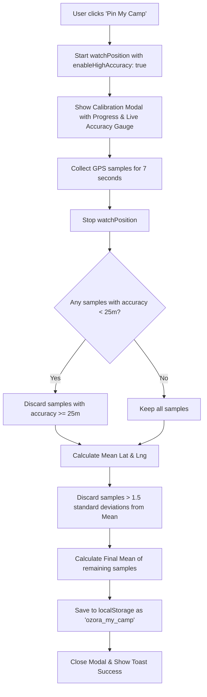

# Design Spec: Offline Camp Pinning & Compass Navigation

This specification details the design and implementation of the **Offline Camp Pinning & Compass Navigation** feature for the Ozora 2026 Timetable Companion. It ensures festival-goers can reliably pin their camp coordinates using high-accuracy GPS calibration and navigate back to their tent in pitch darkness with zero network reception.

---

## User Review Required

> [!IMPORTANT]
> - **GPS Availability**: This feature relies entirely on the browser's `navigator.geolocation` and `DeviceOrientation` APIs. These work offline on modern mobile devices (via satellite GPS and magnetometer sensors), but require explicit user permission.
> - **Safari iOS Orientation Permission**: On iOS Safari, accessing device orientation (magnetometer) requires a user-initiated touch event. Clicking "Enable Compass" or "Navigate" will trigger this request.

---

## Technical Architecture

### 1. Data Layer & Local Storage
The camp coordinate will be saved in `localStorage` under the key `ozora_my_camp`.

```typescript
interface PinnedCamp {
  id: string;        // Always "my-camp" to match POI structure
  name: string;      // "My Camp"
  nameHe: string;    // "האוהל שלי"
  type: string;      // "camping"
  coords: [number, number]; // [latitude, longitude]
  color: string;     // "#ecc94b" (Gold theme accent)
  accuracy: number;  // Calibrated GPS accuracy in meters
  pinnedAt: number;  // Timestamp when pinned
  note?: string;     // Optional short description (e.g. "Green tent under the oak tree")
}
```

This data is dynamically injected into the stateful `pois` list within `VenueMap.jsx` during initialization. By matching the existing POI schema, the camp marker will automatically render on the Leaflet map and participate in the Nearby list distance calculations and search features.

---

### 2. High-Accuracy GPS Calibration
GPS signals can fluctuate significantly, especially on mobile devices under tree cover or during initial satellite acquisition. To prevent pinning a location with high circular error, we will use a dynamic calibration algorithm:



- **Averaging**: Calculating the mean coordinates from multiple readings filters out noise.
- **Outlier Rejection**: Discarding samples that are statistically far from the mean prevents temporary GPS drift from corrupting the pinned location.
- **UX Feedback**: The user sees a counting-down progress indicator and a live metric of how accurate the signal is (e.g., `±5m`), ensuring they stay stationary during calibration.

---

### 3. UI Integration & Entry Points

To maintain a clean layout and ensure 1-tap usability in low-light and altered states, the feature will be exposed through three primary UI channels:

#### A. Floating Action Button (FAB) on Map
- Placed directly above the existing "Center on Me" GPS button on the map.
- Distinct gold styling (`#ecc94b`) with a Lucide `Tent` icon.
- **Action**:
  - If **not pinned**: Launches the Calibration Modal.
  - If **pinned**: Centers map on the tent POI and displays its Leaflet popup with a "Navigate" option.

#### B. Header Quick-Access Icon
- A small golden tent icon will appear in the main header (`Header.jsx`) *only* when a camp location is active in `localStorage`.
- **Action**: Clicking this icon instantly launches the `CompassCard` in navigation mode, showing the compass arrow pointing towards the camp, regardless of which screen the user is currently on (Timetable, Guides, or Map).

#### C. Camping Category Card (Nearby List)
- Inside the "Camps" category scroll of the `Nearby` view, a special card will be pinned to the top:
  - If **not pinned**: Prompts the user to set up their tent location with a prominent "Pin My Camp" CTA.
  - If **pinned**: Displays "My Camp" with active distance, walk time, a "Navigate" button (opens compass), and a "Recalibrate / Delete" menu.

---

### 4. Visual Styles & Theme Adaptability
- **Glow & Glassmorphism**: The calibration modal will feature a dark frosted-glass background (`backdrop-filter: blur(12px)`) to visually isolate it.
- **Sacred Geometry Loader**: A pulsing, geometric SVG animation in the center of the calibration screen to match the festival's cosmic branding.
- **Automatic Themes**: Uses the existing CSS variables so the UI elements adapt automatically to sunrise, day, sunset, and night mode colors.

---

## Verification Plan

### Automated Tests
We will add unit tests in `src/utils/__tests__/gpsCalibration.spec.js` to verify:
1. **Outlier Filtering**: Verifies that coordinate samples with high deviations or poor accuracy are successfully excluded from the final calculation.
2. **Mean Calculations**: Validates that the mathematical mean of latitude and longitude is calculated correctly.
3. **Storage Fallback**: Checks that if geolocation fails or is denied, the calibration fails gracefully and returns the correct error state.

### Manual Verification
1. **Desktop Simulation**:
   - Use Chrome/Safari Developer Tools to override geolocation coordinates.
   - Click "Pin My Camp", observe the 7-second calibration progress.
   - Verify that the gold tent marker appears on the map and is listed under Nearby.
2. **Offline Simulation**:
   - Disconnect the internet connection completely.
   - Verify that clicking the Header Tent icon launches the `CompassCard` overlay and rotates the compass needle correctly based on simulated location.
3. **Contrast & Theme Testing**:
   - Toggle the app between sunrise, day, sunset, and night themes.
   - Verify that text contrast on the calibration screen and the card meets WCAG AA standards (4.5:1 ratio).
